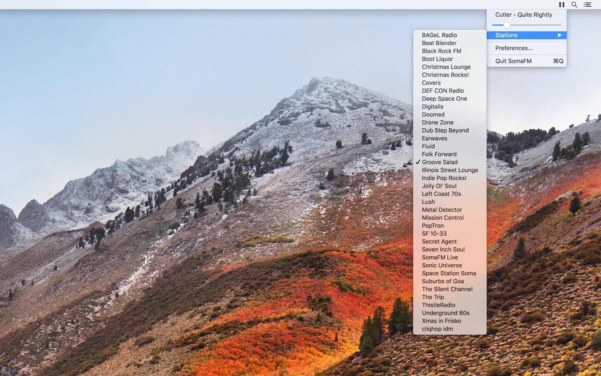

# SomaFM Mini Player for Apple Silicon

[](LICENSE.md)




SomaFM Mini Player is an unofficial macOS menu-bar player that provides minimal, background playback of [SomaFM](https://somafm.com/) channels.

This fork modernizes the original [ealeksandrov/SomaFM-miniplayer](https://github.com/ealeksandrov/SomaFM-miniplayer) project for current Apple silicon Macs while preserving the original app's focused behavior and interface.

## Project Status

Version 1.3.0 targets macOS 13.0 or later and builds as a universal `arm64` and `x86_64` application. Local verification currently uses Xcode 27 beta, while GitHub Actions verifies the project with stable Xcode 26. This repository does not yet publish a signed Mac App Store build; build the application from source using the instructions below.

Current modernization work includes:

- Universal Release builds for Apple silicon and Intel Macs.
- A stable-Xcode CI build and unit-test gate.
- Swift 5 project settings.
- Removal of the old Carthage dependency path.
- Network monitoring through `Network.framework`.
- An instance-based, main-actor playback controller.
- Explicit playback lifecycle states for stopped, buffering, playing, and network recovery.
- Disposal of live `AVPlayerItem` streams while paused, addressing upstream memory-growth issue #11.
- Timed stream metadata through `AVPlayerItemMetadataOutput`.
- Launch at login through the modern `SMAppService` main-application API.
- Local track and network alerts through the `UserNotifications` framework with explicit opt-in authorization.
- Global media controls and Now Playing metadata through the macOS `MediaPlayer` framework once station playback begins.
- Album artwork prefetched when track metadata changes and shown above the track name in the right-click menu, sized no wider than the widest station title.
- Automatic Light and Dark appearance support through AppKit semantic colors and template images.
- A repository safety check that blocks tracked personal signing values, private signing material, local home paths, and common credential formats.
- A dedicated release-optimized soak build and unattended playback lifecycle driver with physical-footprint, RSS, and leak checks.
- XCTest coverage for playback stream disposal, recovery, launch-at-login, notifications, and media controls.
- Local signing configuration that keeps personal Apple Developer values out of git.
- App Store-compatible sandboxing, outbound network access, privacy metadata, and deterministic version numbers.

## Requirements

- An Apple silicon or Intel Mac.
- macOS 13.0 or later.
- Xcode 26 or later. Use a stable Xcode release for App Store archives.

## Build And Test

The normal application does not expose command-line options. The following commands build and test the project itself.

Build an unsigned arm64 Debug application:

```sh
xcodebuild -project SomaFM.xcodeproj -scheme SomaFM -configuration Debug -destination 'platform=macOS,arch=arm64' CODE_SIGN_IDENTITY= CODE_SIGNING_REQUIRED=NO CODE_SIGNING_ALLOWED=NO build
```

Run the build smoke test:

```sh
Scripts/verify-arm64-debug-build.sh
```

Build and verify an unsigned universal Release application:

```sh
Scripts/verify-universal-release-build.sh
```

The universal verifier builds both `arm64` and `x86_64` slices, confirms that each slice declares macOS 13.0 as its minimum OS, checks the built `Info.plist`, and verifies that the privacy manifest is bundled.

Run the public-repository safety check independently:

```sh
Scripts/check-public-repo-safety.sh
```

Run the arm64 unit tests without code signing:

```sh
xcodebuild -project SomaFM.xcodeproj -scheme SomaFM -configuration Debug -destination 'platform=macOS,arch=arm64' CODE_SIGN_IDENTITY= CODE_SIGNING_REQUIRED=NO CODE_SIGNING_ALLOWED=NO test
```

GitHub Actions runs the unit tests and universal Release verification on a stable Xcode 26 runner for every push and pull request.

## Automated Playback Soak Test

The dedicated `Soak` build is release-optimized and compiles in a test-only lifecycle controller. The runner builds it without personal signing, applies a local ad-hoc diagnostic signature, repeatedly exercises play, pause, network wait, recovery, and station navigation, samples physical footprint and resident memory, pauses playback, releases the channel catalog, runs `/usr/bin/leaks`, and exits without human interaction. Releasing the catalog keeps its intentionally live playlist URLs out of the playback-retention report. The diagnostic signature uses only the tracked `Config/Soak.entitlements` file and contains no Apple Developer identity or team information.

Run the standard four-hour test:

```sh
Scripts/run-playback-soak.sh --duration 4h --cycles 60 --station groovesalad
```

Run a short harness check before a long soak:

```sh
Scripts/run-playback-soak.sh --duration 2m --cycles 2 --sample-interval 5
```

Options:

```text
--duration VALUE                 Seconds, or a positive integer with s, m, or h suffix
--cycles COUNT                   Playback lifecycle cycle count
--station ID                     Initial SomaFM station ID
--sample-interval SECONDS        Process-memory sampling interval
--channel-timeout SECONDS        Channel-list startup timeout
--leak-timeout SECONDS           Time allowed for the external leak scan
--max-growth-mb-per-hour VALUE   Physical-footprint trend limit after warmup
--max-final-growth-mb VALUE      Absolute final paused footprint growth allowance
--max-final-growth-ratio VALUE   Relative final paused footprint growth allowance
--max-leaked-bytes BYTES         Maximum total bytes accepted from the leak report
--max-stream-url-roots-per-start VALUE
                                   Maximum stream URL roots per stream start
--max-stream-url-root-overhead COUNT
                                   Fixed stream URL roots allowed beyond the ratio
--results-dir PATH               Result directory instead of a timestamped default
--help                           Display command help
```

The default memory thresholds are 1 MB/hour of physical-footprint growth after warmup, final paused footprint growth no greater than the larger of 10 MB or 10 percent of the first paused sample, and at most 65,536 bytes reported by `leaks`. After catalog cleanup, the runner also permits up to 1.5 small AVFoundation URL roots per stream start plus five fixed roots; exceeding that lifecycle-adjusted bound indicates superlinear or unrelated URL retention. Physical footprint is the pass/fail metric because it better represents the process's private memory cost; RSS remains in the CSV and summary for diagnosis. Stream start and disposal counters are also recorded so lifecycle imbalances are visible. The nonzero byte allowance accommodates small one-time allocations retained by macOS frameworks. Any lifecycle failure, active stream retained while paused, incomplete leak scan, watchdog timeout, or threshold violation makes the command fail. Results are written beneath the ignored `SoakResults/` directory as `build.log`, `app.log`, `samples.csv`, `leaks.txt`, and `summary.json`.

Open the project in Xcode:

```sh
open SomaFM.xcodeproj
```

Select the `SomaFM` scheme and use Xcode's Run command to launch the application.

## Local Signing

Copy the tracked signing example to the ignored local configuration:

```sh
cp Config/Signing.local.example.xcconfig Config/Signing.local.xcconfig
```

Set your Apple Developer team ID and a unique app bundle ID in `Config/Signing.local.xcconfig`. Do not commit that file.

Build with local signing enabled:

```sh
xcodebuild -project SomaFM.xcodeproj -scheme SomaFM -configuration Debug -destination 'platform=macOS,arch=arm64' build
```

## Mac App Store Readiness

The source project now provides the technical foundation for a Mac App Store build:

- macOS 13.0 deployment targets for the app and tests.
- Universal `arm64` and `x86_64` Release output.
- App Sandbox and outbound network client entitlements.
- A media-only App Transport Security exception for AVFoundation streams.
- A privacy manifest declaring app-specific preferences and no collected data or tracking.
- Standard Xcode marketing and build version settings.
- Local-only signing variables for the developer team, bundle ID, identity, and provisioning profile.

Complete these steps before the first submission:

1. Test the signed, sandboxed application on macOS 13, including Apple silicon and Intel when practical.
2. Obtain written authorization to use the SomaFM name, branding, and streams, or revise the product identity and content plan.
3. Join the Apple Developer Program, accept current agreements, and register a permanent explicit bundle ID.
4. Create the macOS app record in App Store Connect using the same bundle ID.
5. Provide a public privacy policy URL and support URL, App Store description, category, age rating, content-rights declaration, screenshots, pricing, and availability.
6. Answer the App Store Connect export-compliance questions. The app uses only operating-system networking and declares that it does not use non-exempt encryption.
7. Set the next unique `CURRENT_PROJECT_VERSION`, choose the `SomaFM` scheme and `Any Mac` destination in stable Xcode, then use Product > Archive.
8. In Organizer, choose Distribute App > TestFlight & App Store and let Xcode manage the Apple Distribution signature and provisioning profile.
9. Exercise the uploaded build through TestFlight, provide App Review notes for the menu-bar interface and launch-at-login option, then submit it for review.

Do not add an Apple Developer team ID, signing identity, profile name, account credential, or private App Store Connect key to the repository. Store local signing values only in ignored `Config/Signing.local.xcconfig`; use repository or organization secrets for any future automated upload credentials.

## Development Workflow

Development practices and the required proposal, documentation, testing, commit, and push loop are defined in [AGENTS.md](AGENTS.md). Begin each task by checking repository status and reading the relevant local project context.

Useful repository commands:

```sh
git status --short --branch
git remote -v
rg --files
```

## Known Limitations And Next Steps

- Playback lifecycle coverage exists, but model decoding, settings, URL construction, and channel sorting need tests.
- The automated soak test provides repeatable RSS and leak regression coverage; Instruments remains useful for deeper allocation profiling.
- Runtime compatibility still needs to be exercised on macOS 13, including Intel hardware or a representative virtual machine.
- Mac App Store signing and upload require the maintainer's private Apple Developer account configuration.
- SomaFM name, branding, and stream authorization must be resolved before App Review.

## Author And Upstream

This Apple silicon modernization fork is maintained by Matthew Bohl (matthewbohl@gmail.com). It is based on the original application created by Evgeny Aleksandrov ([@ealeksandrov](https://twitter.com/ealeksandrov)).

Upstream repository: [ealeksandrov/SomaFM-miniplayer](https://github.com/ealeksandrov/SomaFM-miniplayer)

Working repository: [matthewbohl/SomaFM-miniplayer-apple-silicon](https://github.com/matthewbohl/SomaFM-miniplayer-apple-silicon)

## License

SomaFM Mini Player is available under the MIT license. See [LICENSE.md](LICENSE.md).
